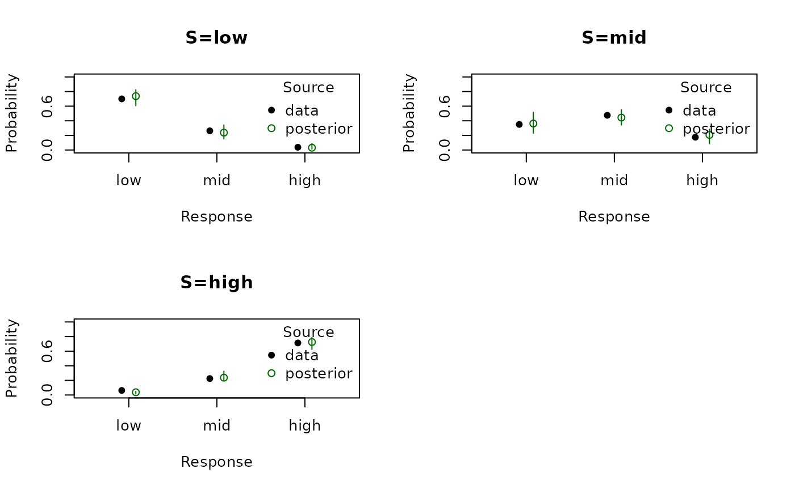
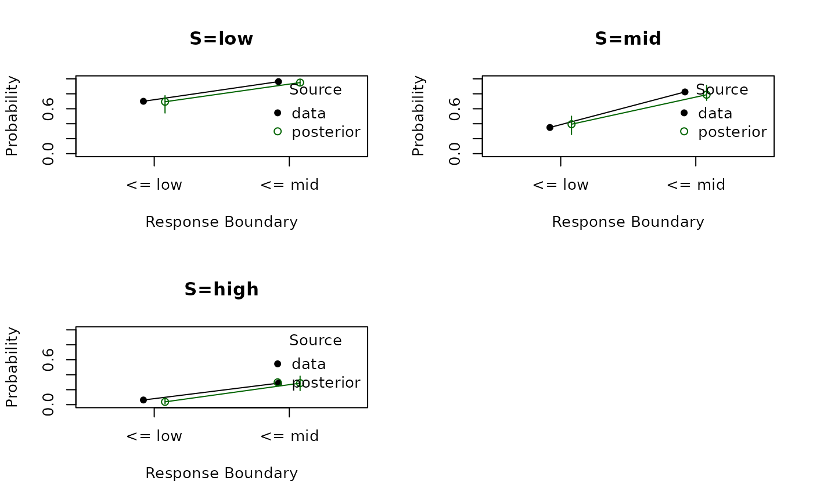

# Response Models

## Introduction

This vignette shows how to use the response-only models currently
implemented in *EMC2*. These models fall into two different response
geometries:

1.  Ordered response models:
    [`ordered_probit()`](https://ampl-psych.github.io/EMC2/reference/ordered_probit.md)
    and
    [`ordered_logit()`](https://ampl-psych.github.io/EMC2/reference/ordered_logit.md)
2.  Multinomial choice models:
    [`multinomial_logit()`](https://ampl-psych.github.io/EMC2/reference/multinomial_logit.md)
    and
    [`multinomial_probit()`](https://ampl-psych.github.io/EMC2/reference/multinomial_probit.md)

Ordered response models assume a single latent evidence variable and one
or more cutpoints. In the binary case this is the same general setup as
signal detection theory: a latent evidence value is compared against a
criterion. With more than two ordered responses, the single criterion
becomes a set of ordered criteria, as in rating or confidence versions
of Signal Detection Theory (SDT).
[`ordered_probit()`](https://ampl-psych.github.io/EMC2/reference/ordered_probit.md)
uses a Gaussian latent noise distribution, which makes it the closest
match to classical Gaussian SDT.
[`ordered_logit()`](https://ampl-psych.github.io/EMC2/reference/ordered_logit.md)
uses the same threshold geometry but with logistic noise.

Multinomial response models are different. They are not threshold models
on one evidence axis, but random-utility models over a set of
alternatives.
[`multinomial_logit()`](https://ampl-psych.github.io/EMC2/reference/multinomial_logit.md)
is the standard multinomial-logit or softmax model: each response has a
latent utility and the response probabilities are a softmax over those
utilities.
[`multinomial_probit()`](https://ampl-psych.github.io/EMC2/reference/multinomial_probit.md)
uses the same utility geometry but with Gaussian noise instead of the
softmax/logit noise assumption.

The worked examples below use
[`ordered_probit()`](https://ampl-psych.github.io/EMC2/reference/ordered_probit.md)
and
[`multinomial_logit()`](https://ampl-psych.github.io/EMC2/reference/multinomial_logit.md).
The other two models follow the same design logic, but swap the latent
noise distribution within the same geometry.

The workflow is the same as for the DDM and race models:

1.  Specify the design
2.  Inspect sampled parameters and their mapping to design cells
3.  Simulate data
4.  Define priors and create an `emc` object
5.  Fit the model
6.  Summarize posterior estimates and compare observed and posterior
    predictive choice proportions

``` r

choice_summary <- function(data) {
  out <- as.data.frame(prop.table(table(data$S, data$R), 1))
  names(out) <- c("S", "R", "prob")
  out
}
```

## 1. Ordered Response Models

Ordered response models place responses on a single latent evidence axis
and use cutpoints to divide that axis into response categories. Here we
use a 3-category task with `low`, `mid`, and `high` stimuli and
responses. `location` depends on stimulus identity, `scale` is fixed to
1, and `cut ~ 1` estimates the standard `K - 1` thresholds.

Conceptually, this is the SDT-like response family in *EMC2*. In a
binary yes/no task there is one criterion. In a 3-category task there
are two ordered criteria. `location` shifts the latent evidence
distribution, and `cut` determines where the response boundaries lie.

``` r

matchfun <- function(d) d$S == d$lR

design_ord <- design(
  Rlevels = c("low", "mid", "high"),
  factors = list(subjects = 1, S = c("low", "mid", "high")),
  formula = list(location ~ 0 + S, scale ~ 1, cut ~ 1),
  matchfun = matchfun,
  constants = c(scale = log(1)),
  model = ordered_probit
)
```

    ## 
    ##  Sampled Parameters: 
    ## [1] "location_Slow"  "location_Smid"  "location_Shigh" "cut_lRlow"     
    ## [5] "cut_lRmid"     
    ## 
    ##  Design Matrices: 
    ## $location
    ##     S location_Slow location_Smid location_Shigh
    ##   low             1             0              0
    ##   mid             0             1              0
    ##  high             0             0              1
    ## 
    ## $scale
    ##  scale
    ##      1
    ## 
    ## $cut
    ##   lR cut_lRlow cut_lRmid
    ##  low         1         0
    ##  mid         0         1

[`sampled_pars()`](https://ampl-psych.github.io/EMC2/reference/sampled_pars.md)
shows the free parameters, and
[`mapped_pars()`](https://ampl-psych.github.io/EMC2/reference/mapped_pars.md)
shows how they map to the latent design cells.

``` r

sampled_pars(design_ord)
```

    ##  location_Slow  location_Smid location_Shigh      cut_lRlow      cut_lRmid 
    ##              0              0              0              0              0

``` r

p_vector_ord <- sampled_pars(design_ord)
p_vector_ord[] <- c(-1, 0, 1.2, -0.4, log(1.3))

mapped_pars(design_ord, p_vector_ord)
```

    ##      S  lR    lM location scale    cut cut_expanded
    ## 1  low low  TRUE     -1.0     1 -0.400         -0.4
    ## 2  low mid FALSE     -1.0     1  0.262          0.9
    ## 4  mid low FALSE      0.0     1 -0.400         -0.4
    ## 5  mid mid  TRUE      0.0     1  0.262          0.9
    ## 7 high low FALSE      1.2     1 -0.400         -0.4
    ## 8 high mid FALSE      1.2     1  0.262          0.9

Now we simulate data from these parameters:

``` r

dat_ord <- make_data(parameters = p_vector_ord, design = design_ord, n_trials = 80)
```

For choice-only models it is often most useful to inspect response
proportions directly:

``` r

choice_summary(dat_ord)
```

    ##      S    R   prob
    ## 1  low  low 0.7000
    ## 2  mid  low 0.3500
    ## 3 high  low 0.0625
    ## 4  low  mid 0.2625
    ## 5  mid  mid 0.4750
    ## 6 high  mid 0.2250
    ## 7  low high 0.0375
    ## 8  mid high 0.1750
    ## 9 high high 0.7125

Next we define a prior and create the `emc` object.

``` r

prior_ord <- prior(
  design = design_ord,
  type = "single",
  pmean = c(
    location_Slow = -0.5,
    location_Smid = 0,
    location_Shigh = 0.5,
    cut_lRlow = -0.2,
    cut_lRmid = log(1.1)
  ),
  psd = c(
    location_Slow = 0.8,
    location_Smid = 0.8,
    location_Shigh = 0.8,
    cut_lRlow = 0.5,
    cut_lRmid = 0.3
  )
)

emc_ord <- make_emc(dat_ord, design_ord, prior_list = prior_ord, type = "single", n_chains = 2)
```

    ## Processing data set 1

    ## Likelihood speedup factor: 26.7 (9 unique trials)

## 2. Fit the Ordered Model

The following call fits the model and saves the result:

``` r

emc_ord <- fit(emc_ord, fileName = "data/response-models-ordered.RData")
```

[`summary()`](https://rdrr.io/r/base/summary.html) reports posterior
quantiles, `Rhat`, and ESS:

``` r

summary(emc_ord)
```

    ## 
    ##  alpha 1 
    ##                  2.5%    50%  97.5%  Rhat  ESS
    ## location_Slow  -1.596 -0.883 -0.144 0.999 2157
    ## location_Smid  -0.730 -0.030  0.704 1.000 1871
    ## location_Shigh  0.566  1.320  2.086 1.000 1974
    ## cut_lRlow      -1.050 -0.363  0.333 1.000 2155
    ## cut_lRmid      -0.030  0.167  0.348 1.001 1907

[`plot_pars()`](https://ampl-psych.github.io/EMC2/reference/plot_pars.md)
compares the posterior to the generating values:

``` r

plot_pars(emc_ord, true_pars = p_vector_ord, use_prior_lim = FALSE)
```


Finally,
[`plot_fit_choice()`](https://ampl-psych.github.io/EMC2/reference/plot_fit_choice.md)
compares observed response probabilities to posterior predictive
intervals:

``` r

plot_fit_choice(emc_ord, factors = "S", style = "prob", n_post = 20)
```



For ordered responses, cumulative fits can also be useful because they
reflect the threshold structure directly:

``` r

plot_fit_choice(emc_ord, factors = "S", style = "cumulative", n_post = 20)
```



To switch from ordered probit to ordered logit, the design is identical
except for the model choice. That is, the latent threshold structure
stays the same, but the Gaussian link is replaced by a logistic one:

``` r

design_ord_logit <- design(
  Rlevels = c("low", "mid", "high"),
  factors = list(subjects = 1, S = c("low", "mid", "high")),
  formula = list(location ~ 0 + S, scale ~ 1, cut ~ 1),
  matchfun = matchfun,
  constants = c(scale = log(1)),
  model = ordered_logit
)
```

EMC2 also supports multinomial probit and logit response models, they
have documentation, but they mostly exist to be paired with trend
models, more on that later!
